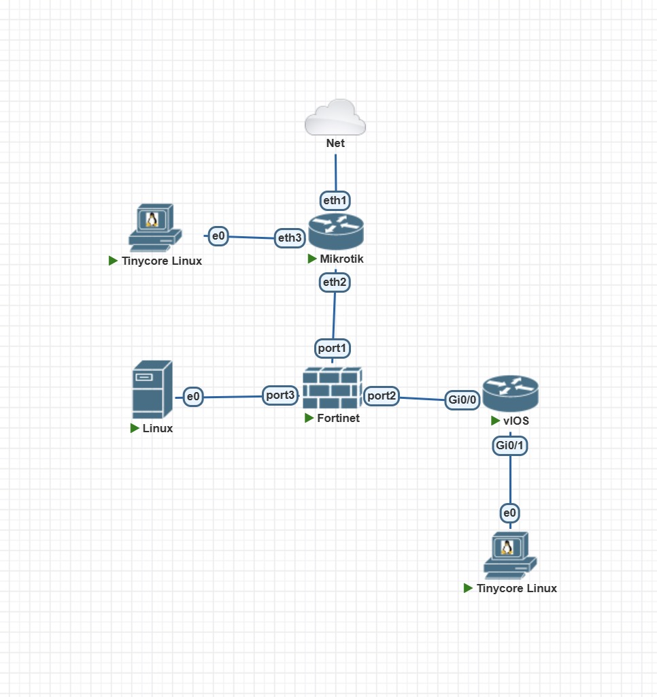
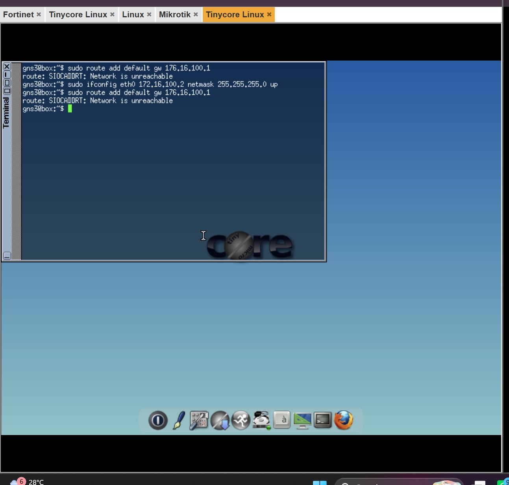
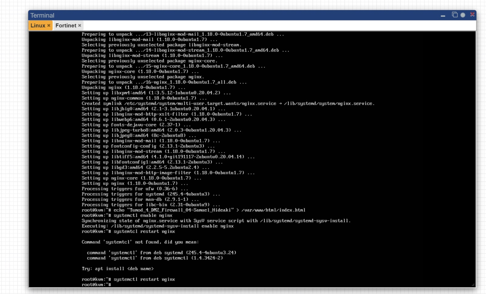
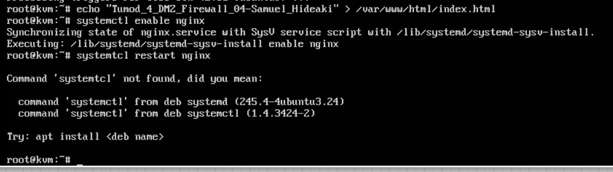

# Tugas Modul 4 — Firewall & NAT

## 1. Topologi Jaringan

## 2. Tabel IP Address

| Perangkat | Interface | IP Address | Gateway | Keterangan |
|-----------|-----------|------------|---------|------------|
| MikroTik ISP | ether1 | DHCP Client | DHCP lab | Ke Cloud/lab |
| MikroTik ISP | ether2 | `10.10.10.1/30` | - | Ke FortiGate port1 |
| MikroTik ISP | ether3 | `172.16.100.1/24` | - | Gateway Client WAN |
| FortiGate | port1 | `10.10.10.2/30` | `10.10.10.1` | Interface WAN |
| FortiGate | port2 | `10.20.20.1/30` | - | Interface INSIDE ke Cisco |
| FortiGate | port3 | `192.168.20.1/24` | - | Interface DMZ |
| Cisco Router | G0/0 | `10.20.20.2/30` | - | Ke FortiGate port2 |
| Cisco Router | G0/1 | `192.168.10.1/24` | - | Gateway LAN |
| Client LAN | eth0 | `192.168.10.10/24` | `192.168.10.1` | Client internal |
| Client WAN | eth0 | `172.16.100.2/24` | `172.16.100.1` | Client luar |
| Ubuntu Server | ens3 | `192.168.20.10/24` | `192.168.20.1` | Web server DMZ |

## 3. Konfigurasi Perangkat

### MikroTik ISP

MikroTik ISP dikonfigurasi dengan DHCP Client di ether1, IP statis di ether2 dan ether3, NAT masquerade, dan routing statis ke LAN dan DMZ via FortiGate.

---

### FortiGate

FortiGate dikonfigurasi dengan tiga interface (WAN, INSIDE, DMZ), default route ke `10.10.10.1`, static route ke LAN via Cisco, dan firewall policy.

.jpeg)

.1.jpeg)

.jpeg)

---

### Cisco Router

Cisco Router dikonfigurasi dengan IP di dua interface dan default route menuju FortiGate `10.20.20.1`.

---

### Client LAN (Tinycore Linux)

Client LAN dikonfigurasi dengan IP statis `192.168.10.10/24` dan gateway `192.168.10.1`.

---

### Client WAN (Tinycore Linux)

Client WAN dikonfigurasi dengan IP statis `172.16.100.2/24` dan gateway `172.16.100.1`.

---

### Ubuntu Server DMZ

Ubuntu Server dikonfigurasi dengan IP statis, install Nginx, dan halaman default diubah menjadi `Tumod_4_DMZ_Firewall_04-Samuel_Hideaki`.

## 4. Hasil Pengujian

### 1. Client LAN ke Gateway Cisco (`192.168.10.1`)

.jpeg)

### 2. Client LAN ke FortiGate (`10.20.20.1`)

.jpeg)

### 3. Client LAN ke Server DMZ (`192.168.20.10`)

.jpeg)

### 4. Client LAN Akses Web DMZ

.jpeg)

### 5. Client WAN Ping ke MikroTik ISP (`172.16.100.1`)

.jpeg)

### 6. Client WAN Ping ke FortiGate (`10.10.10.2`)

.jpeg)

### 7. Client WAN Akses Web Server via `http://10.10.10.2`

.jpeg)

### 8 & 9. Client WAN Ping ke LAN dan DMZ — Blocked

.jpeg)

### 10. Server DMZ Ping ke Client LAN

---

## 5. Analisis dan Kesimpulan

Secara keseluruhan, tugas modul ini hampir semuanya berhasil berjalan sesuai yang diharapkan. Konfigurasi FortiGate, Client WAN, dan Ubuntu Server DMZ berhasil diterapkan dengan baik. Client LAN bisa ping ke gateway Cisco dan FortiGate, serta berhasil mengakses halaman web Nginx di server DMZ via browser. Client WAN berhasil mengakses web server lewat port forwarding VIP di FortiGate via `http://10.10.10.2`, dan terbukti tidak bisa ping langsung ke Client LAN maupun IP asli DMZ yang membuktikan firewall policy berjalan dengan benar.

Terdapat satu kendala yang ditemui selama pengerjaan yaitu ping dari Client LAN ke server DMZ yang menghasilkan 95% packet loss meskipun sebagian kecil paket berhasil terkirim, kemungkinan disebabkan konfigurasi firewall policy FortiGate yang belum sepenuhnya optimal saat pengujian dilakukan. Meski begitu, hasil pengujian utama berhasil dibuktikan melalui screenshot yang tersedia.

Lewat tugas modul ini, bisa dipahami secara langsung gimana cara kerja firewall yang lebih kompleks menggunakan FortiGate sebagai firewall utama dengan segmentasi jaringan WAN, LAN, dan DMZ. Dengan memahami konsep tersebut, praktikan jadi tau cara kerja dasar keamanan jaringan serta ngerti gimana router dan firewall ngatur koneksi antar perangkat dan akses internet secara nyata.
